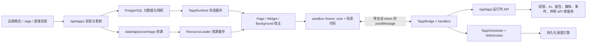
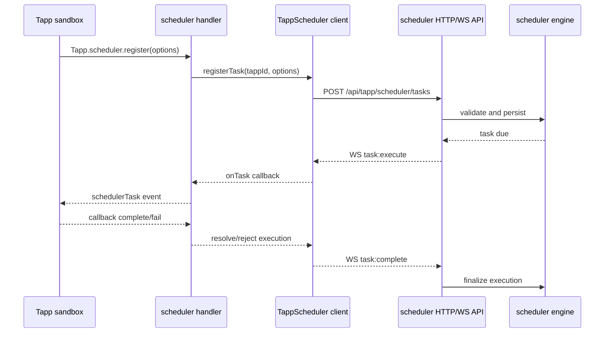

# Tapp 架构

本文描述当前代码中的 Tapp（Third-party App）实现。它是维护者理解安装、运行、
沙箱、后台任务和后端服务边界的总入口；字段与 API 的细节分别以
[Manifest](MANIFEST.md)、[SDK API](API_REFERENCE.md) 和
[REST API](REST_API.md) 为准。

Runtime Grant、One-shot Data Exchange、AI Task、Scoped Event Broker 和 Agent Interaction
的当前契约与迁移状态见
[Tapp Runtime 契约设计](RUNTIME_CONTRACT_DESIGN.md)。共享 registry/mailbox、Agent task 恢复、
宿主 intent adapter、签名 guest session 与硬存储配额均已进入当前实现。

## 一句话模型

第一次读可以先记住四件事：包按**层**组织（共享层 `core`、页面层 `page`、每个小组件一层）；
运行时有 **Page / Widget / headless** 三种沙箱；安装来源是 **`direct` / `store` / `install-file`**；
生命周期是 **隐藏 / 销毁 / 卸载 / 常驻**（看不见不等于销毁，离开页面也不等于把 iframe 冻住）。

Tapp 不是把第三方脚本直接加载到 Myriad 页面中，而是：

1. 后端校验并持久化 Manifest、代码、资源和授权结果；
2. 前端宿主根据场景只组合 `core + widget`、`core + page` 或纯 `core`；
3. 代码在带 CSP 的 sandbox iframe 中运行；
4. Tapp 只能通过 `postMessage` Bridge 调用宿主 SDK；
5. Bridge 做前端权限预检，后端再次做身份、所有权、权限、速率、输入和出站安全校验。

宿主写入 `srcdoc` 的 Manifest 元数据、Widget props、i18n 和启动参数必须使用 inline-script
序列化器；Tapp JavaScript 源码必须转义 HTML 的 `</script` 终止序列。直接把字符串插入
`<script>` 会让合法名称、设置值或代码静默截断整个沙箱。

Dashboard Widget 在懒加载、runtime 同步与 iframe ready 前由宿主绘制统一骨架（见
[WIDGET.md · 宿主加载骨架](WIDGET.md#宿主加载骨架widget-skeleton)）；Tapp 应尽快
`onReady`，不要再实现整卡 Spinner。

## 代码边界

| 层         | 主要位置                                                   | 职责                                               |
| ---------- | ---------------------------------------------------------- | -------------------------------------------------- |
| 页面入口   | `frontend/src/tapp/pages/`                                 | 列表、详情、单窗口/多窗口运行入口                  |
| 列表布局   | `frontend/src/tapp/pages/TappListPage.tsx`、`frontend/src/tapp/services/TappListCardSizesApi.ts`、`backend/src/api/tapp_store/list_card_sizes.rs`、`backend/src/services/tapp_list_card_sizes.rs` | 卡片 1x1/2x1、mine/site 范围、个人 vs 站点布局偏好 |
| 运行壳     | `frontend/src/tapp/components/TappAppShell.tsx`、`frontend/src/tapp/components/TappWindowManager.tsx`、`frontend/src/tapp/hooks/useTappMultiWindowSession.ts` | 多窗口会话、全屏 chrome、关闭/presence             |
| 安装/卸载 UI | `frontend/src/tapp/components/InstallTappDialog.tsx`、`frontend/src/tapp/components/UninstallConfirmDialog.tsx` | 权限同意安装、卸载确认与清理预设文案               |
| 宿主状态   | `frontend/src/tapp/runtime/TappRuntime.ts`                 | 已安装/运行状态缓存、Widget 注册、后台需求         |
| 资源加载   | `frontend/src/tapp/runtime/sandbox/resourceLoader.ts`      | 获取、拆分、缓存代码/CSS/HTML/i18n/Page 模块       |
| 沙箱宿主   | `frontend/src/tapp/runtime/TappPageSandbox.tsx`、`frontend/src/tapp/runtime/TappWidgetSandbox.tsx` | 创建 iframe、生成 HTML、注册对应 handler、清理实例 |
| Widget 加载面 | `frontend/src/components/widgets/shared/WidgetSkeleton.tsx`、`frontend/src/hooks/useTappWidgets.ts` | Dashboard 第三方 Widget 默认骨架（defer / 屏外静态 / themeColor） |
| 后台宿主   | `frontend/src/tapp/components/TappBackgroundRunner.tsx`    | 为需要常驻的运行中 Tapp 拉起 headless core         |
| SDK/Bridge | `frontend/src/tapp/runtime/sandbox/sdkGenerator.ts`、`frontend/src/tapp/runtime/TappBridge.ts` | 生成沙箱 SDK、验证消息、权限预检、分发 handler     |
| 前端 API facade | `frontend/src/tapp/services/TappApiService.ts`        | 领域 API 聚合导出与默认对象装配                    |
| Tapp 路由装配 | `backend/src/api/tapp_store.rs`                         | 路由组合、子模块声明与公共重导出                    |
| 访问上下文 | `backend/src/api/tapp_store/access.rs`                    | 可见安装选择、所有权、权限过滤与存储访问身份        |
| API 响应类型 | `backend/src/api/tapp_store/types.rs`                   | 通用响应 envelope、列表项与详情 DTO                 |
| 运行生命周期 | `backend/src/api/tapp_store/lifecycle.rs`               | 启停状态、Runtime Grant 吊销与最近使用记录          |
| 安装与更新 | `backend/src/api/tapp_store/installation.rs`               | 直接/文件安装、staging 事务与更新回滚               |
| 预处理安装包 | `backend/src/api/tapp_store/prepared_package.rs`          | 统一结构化/归档包校验、资源落盘与安装代际写入       |
| 商店包获取 | `backend/src/api/tapp_store/store_package.rs`               | 可信出站访问、索引匹配、分类校验与远程资源下载      |
| 卸载事务   | `backend/src/api/tapp_store/uninstall.rs`                  | private-first 鉴权、事务清理、目录隔离与失败恢复；`cleanup-temporary` 按站点策略 |
| 列表卡片尺寸 | `backend/src/api/tapp_store/list_card_sizes.rs`、`backend/src/services/tapp_list_card_sizes.rs` | GET 双布局 / PUT 纯个人；游客只读站点布局 |
| 运行时 API | `backend/src/api/tapp_runtime/`                            | AI、数据、上下文、媒体、事件、报告、访问统计、声明 API 等 |
| 调度入口   | `backend/src/api/tapp_scheduler.rs`                        | HTTP/WS 协议、身份/所有权/权限检查                 |
| 调度引擎   | `backend/src/services/tapp_scheduler.rs`                   | 任务持久化、触发、重试、前端回执、后端动作         |
| Manifest 契约 | `crates/tapp-contract/src/manifest.rs`                  | 可安装 `TappManifest`（`deny_unknown_fields`）、声明能力、Widget/设置/API 数据结构 |
| 权限/路径契约 | `crates/tapp-contract/`                                 | 权限目录、存储键与路径校验、Manifest 校验、宿主 CSS 固定路径；不含授予、HMAC、transform 求值 |
| Tapp 纯规则 | `crates/myriad-tapp-rules/`                             | HMAC、transform pipeline、已安装资源计划、federation feed、package fs/prepared；backend 对应模块 `pub use` |
| Agent 纯规则 | `crates/myriad-agent-rules/`                            | 文本上限、brew/MCP/scrape 策略、retry/task 投影；backend `*_pure.rs` `pub use` |
| Tapp 目录查询 | `backend/src/api/tapp_store/catalog.rs`                  | 角色权限过滤、private-first 列表与详情查询          |
| Manifest 校验 | `backend/src/api/tapp_store/validation.rs`              | 路径、权限、资源配额及声明能力的纯校验边界          |
| 包文件生命周期 | `backend/src/api/tapp_store/package_files.rs`           | staging/activate/recovery、资源读写与归档安全边界   |
| 包读取 API | `backend/src/api/tapp_store/package_api.rs`                 | 代码、资源、静态资产可见性与 `.tapp` 导出           |
| 商店源管理 | `backend/src/api/tapp_store/store_sources.rs`               | 商店源查询及管理员 CRUD                             |
| Tapp 存储 | `backend/src/api/tapp_store/storage.rs`                      | 设置鉴权、私有命名空间、事务配额与存储路由          |
| Widget 注册表 | `backend/src/api/tapp_store/widgets.rs`                  | Manifest 同步、所有权可见性与动态注册事务           |
| 前端传输层 | `frontend/src/tapp/services/TappHttpClient.ts`              | CSRF、Runtime Grant 恢复、响应 envelope 与 SSE 解析 |
| 前端运行时 API | `frontend/src/tapp/services/TappContextApi.ts` / `TappHostIntegrationApi.ts` / `TappInteractionApi.ts` | Context/Declared API、报告媒体、组件与事件交互 |
| 前端数据 API | `frontend/src/tapp/services/TappStorageApi.ts` / `TappPlatformApi.ts` / `TappReportCatalogApi.ts` / `TappAnalyticsApi.ts` | 私有存储、平台数据、只读报告目录与站点访问统计聚合 |
| 前端 Widget API | `frontend/src/tapp/services/TappWidgetApi.ts`         | Widget 注册、查询与注销                             |
| 前端包资源 API | `frontend/src/tapp/services/TappPackageResourceApi.ts` | 已安装代码、资源、静态资产与导出                    |
| 前端治理 API | `frontend/src/tapp/services/TappRuntimeAccessApi.ts` / `TappAiApi.ts` | Runtime Grant、数据交换与服务端治理 AI 任务        |
| 前端安装 API | `frontend/src/tapp/services/TappInstallationApi.ts`      | 安装、更新、卸载与临时安装清理                      |
| 前端生命周期 API | `frontend/src/tapp/services/TappLifecycleApi.ts`      | 列表、详情、最近使用、启动与停止                    |
| 声明 API   | `backend/src/services/tapp_api_service.rs`                 | 模板注入、出站请求、builtin、上下文隔离缓存        |

`frontend/src/tapp/types/index.ts` 是前端运行时类型入口。运行时类型不得依赖
`examples/`；示例目录只是内置开发/演示应用的源代码。

内部模块、类型和职责名称不使用 `v2`、`v3` 等代际后缀；应按稳定职责命名。只有已经发布的
HTTP 路径、Bridge method、持久化 key/channel 或 Manifest `protocolVersion` 可以保留数字，
因为它们属于需要兼容的 wire/storage 契约。

## Manifest、安装包与安装态

### 安装来源

系统有三条安装路径，但最终都生成同一种安装态：

| 来源     | 入口                                       | 行为                                                      |
| -------- | ------------------------------------------ | --------------------------------------------------------- |
| 直接安装 | `POST /api/tapps/install`, `source=direct` | 请求直接携带 Manifest、代码和可选资源                     |
| 商店安装 | `POST /api/tapps/install`, `source=store`  | 后端从已配置商店下载；网络失败或大包时前端可下载后回退到 direct |
| 文件安装 | `POST /api/tapps/install-file`             | 上传 ZIP 格式 `.tapp`，安全解包后安装                     |

远程目录格式、源 CRUD、`storeSource` 语义与发布清单见 **[Tapp 商店](STORE.md)**。

安装和更新时必须先校验 Tapp ID、Manifest 资源路径、资源类型和命名资源键。安全的嵌套
相对路径会原样保留；绝对路径、隐藏路径、反斜杠和 `..` 会被拒绝。入口、CSS、HTML 模板
和 Page 模块必须使用对应扩展名，声明资源必须是普通 UTF-8 文本文件；公开读取不会跟随
安装后插入的文件或中间目录符号链接。

资源不会直接写入在线目录。安装和更新先写入同一文件系统下的 staging 目录，完整校验后
通过 rename 原子切换；数据库写入失败会恢复旧目录。卸载先把在线目录原子移入隔离位置，
再在一个数据库事务中删除 Widget、调度任务/执行记录、可选 storage 和安装记录；事务失败
会把目录移回。最终冲突复核、目录切换和数据库写入由按公开 `tappId` 获取的 PostgreSQL
advisory transaction lock 串行化；管理员命名空间和普通用户命名空间也使用同一把锁，避免
多个后端副本同时通过查重后互相覆盖。每个激活目录还写入与数据库 `updated_at` 对应的安装
代际标记；若进程在目录 rename 与数据库 commit 之间退出，启动恢复会用数据库代际选择匹配
的 backup/uninstall 目录并清理遗留 staging。这样恢复后只会暴露完整旧版或完整新版资源。

### 两类持久化

- PostgreSQL 保存 Tapp 元数据、完整 Manifest、状态、最终授权、Widget、存储、
  调度任务/执行记录等结构化数据。
- `backend/data/tapps/{user_id}/{tapp_id}/` 保存代码、CSS、HTML、i18n 和 Page
  模块等安装资源。数据库中的历史路径字段只是兼容元数据，读取时会从已校验的
  owner + Tapp ID 重新计算可信路径。

Manifest 会经历 Rust 结构的反序列化和再序列化。因此新增 Manifest 字段时，必须
同步修改前端 `TappManifest`、后端 `TappManifest`（及嵌套结构）并增加 round-trip
测试，否则字段可能在安装、更新或导出后静默丢失。

### 所有权与可见性

- 站点首次创建的管理员 ID 是规范的公开安装 owner（按最小 ID 确定）；所有当前管理员都在
  这个单一命名空间中安装、更新和管理全局 Tapp，不会以各自账号产生多个公开副本。
- 普通用户可拥有自己的临时 Tapp；列表由当前用户私有 Tapp 与管理员公开 Tapp 组成。同一
  `tapp_id` 若用户已安装私有副本，列表/详情/运行时一律优先打开私有安装；游客与未安装
  私有副本的用户继续使用站点公开安装。
- 游客只能运行管理员共享的 Tapp；Tapp 可通过 `Tapp.user.getRole()` 感知角色。对于
  Federation 内容，游客只获得公开 Feed，已登录用户获得公开内容与自己的个人内容；
  游客不能关注、发布、私聊、进入私有 Room 或传输文件。
- 用户私有安装与站点公开安装可双向并存；冲突检查只针对操作者可修改的 owner 命名空间，
  因而普通用户不能用私有副本抢占 ID、阻止管理员后续发布。详情、资源、Widget、最终授权和
  Manifest 声明 API 必须选择同一安装记录。storage/Widget 的 ORM 不提供仅按 `tappId`
  的关联，查询必须显式携带 `user_id + tapp_id`。
- **主体私有 Storage**：`Tapp.storage` 的 `user_id` 是 Runtime Grant subject（持久用户或
  **签名游客 session**）。打开管理员公开安装时，每个 subject 读写自己的
  `user_id + tapp_id` 空间（游客为负 id 命名空间），不会读取站点 owner 数据。
  Manifest 声明的安装级设置、以及安装级共享数据（`Tapp.shared`）继续存放在安装
  owner 命名空间；owner 或管理员可写，能打开该安装的运行者（含游客）可读。宿主内部键
  不会出现在通用 storage API 中。
- 管理员控制面权限不等于普通用户私有安装的运行时访问权。代码、资源、Manifest、授权和
  Runtime Grant 只能解析到规范公开 owner 或当前主体自己的 owner，不能从其他用户同 ID
  记录中任意选择。

### 列表页布局（个人 vs 站点）

宿主列表 UI（`TappListPage`）支持：

- **范围**：`mine`（个人相关安装）与 `site`（站点公开目录视图）。
- **卡片尺寸**：`1x1` / `2x1`；登录用户可拖拽排序（auth）。
- **布局来源分离**：个人 `sizes`/`order` **不**再 sticky 合并站点 owner 偏好；站点视图只读
  `site_sizes`/`site_order`。游客 GET 只拿到站点布局且 `writable: false`。
- **隐私**：列表卡片不向访客泄露安装 owner 身份字段。

端点见 [REST_API · 列表布局](REST_API.md#列表布局-apitappslist-card-sizes)。

### 私有安装生命周期清理

站点可配置 `tapp_private_install_cleanup`：

| 值 | 登出时 `POST /api/tapps/cleanup-temporary` | 每日 worker（`main.rs` 后台循环） |
| -- | ------------------------------------------ | ----------- |
| `inactivity`（默认） | no-op | 按 `tapp_private_install_inactivity_days` 全局 prune 不活跃用户私有安装 |
| `logout` | 仅卸载**当前用户**私有安装 | **no-op**（`mode != "inactivity"` 时 `continue`；不跑全局 prune） |

实现：`backend/src/api/tapp_store/uninstall.rs`（`cleanup_temporary_tapps` +
`prune_stale_private_tapps`）、`backend/src/main.rs` worker、配置读写
`permissions_oauth` / DynamicConfig。详情见 [REST_API · 私有安装清理](REST_API.md#私有安装清理-post-apitappscleanup-temporary)。

## `core`、`widget`、`page` 三层

每层在包里各自有入口文件，由 Manifest 的 `core` / `page` / `widgets[].entry` 声明；
层内其余文件由入口用相对路径 `require` 进来。宿主按 mode 只下发相关层的依赖图，
再把这些文件静态包装成模块工厂注入 iframe。

| 模式     | 执行代码                    | UI 资源                        | 主要宿主                   |
| -------- | --------------------------- | ------------------------------ | -------------------------- |
| Widget   | core 入口 + 该 widget 入口  | 指定尺寸模板、Widget CSS       | `TappWidgetSandbox`        |
| Page     | core 入口 + page 入口       | Page HTML、Page CSS、i18n      | `TappPageSandbox`          |
| Headless | 仅 core 入口                | 不加载 Page/Widget HTML 与 CSS | `TappPageSandbox headless` |

core 在三种模式下都先执行，模块化不改变这一点；只有后台专属逻辑需要用
`_TAPP_MODE === 'core'` 自行守卫。

边界约束：

- `core` 放共享状态、后台监听、调度回调和不依赖可见 DOM 的逻辑。
- `widget` 只负责小组件定义/渲染；不要假设完整 Page SDK handler 都存在。
- `page` 负责完整页面生命周期和交互。
- headless core 没有可见容器，不能把后台任务写在 Page render/onReady 的 UI 分支中。

## 生命周期和状态

后端 `installed/running/...` 只表示安装 owner 自己的持久生命周期。管理员 Tapp 对其他用户
是“可见的共享安装”，不能把管理员的 running 传播成访客或普通用户已经运行。
`TappRuntime` 另外维护当前浏览器会话主动启动的共享 Tapp；强制同步会保留该会话状态，
但首次访客同步绝不会自动拉起共享 Tapp 的 Page、Widget 或 headless core。

启动流程：

1. owner 启动自己的安装时调用后端 start；共享 Tapp 只记录当前浏览器会话状态；
2. 本地状态改为 running；
3. 注册 Manifest 的 `backgroundRequirements`；
4. 页面、Widget 或后台 Runner 按需要创建独立 iframe；
5. iframe 销毁时清理 Bridge、事件、调度回调和 WebSocket 订阅。

最近使用记录通过 PostgreSQL `ON CONFLICT` 原子累加；同一用户从多个标签页或多个后端副本
同时启动同一 Tapp，不会因先查后插竞态产生重复键错误或丢失运行次数。

SDK 的 `lifecycle.onDestroy` 同时监听 `pagehide` 与 `beforeunload`，并以 once 语义执行；
单个生命周期回调抛错不能阻断其他回调。宿主资源释放仍由 iframe 外部 cleanup 负责，不能把
授权撤销或服务端取消只寄托在浏览器卸载回调上。

**Storage、Settings 与 Shared 分离**：

- 私有 `Tapp.storage` 经 Runtime Grant 挂在 **subject** 命名空间（持久用户或签名游客）；
  `_settings.`、`_shared.` 等为宿主保留前缀，storage API 不可访问。`storage:read` /
  `platform:read` 均为 **guest-safe basic**（与 [REST_API · Widget 与存储](REST_API.md#widget-与存储) 一致）：
  签名游客可获 Grant 与负 id 下持久 storage、以及平台公开缓存读；无签名 session 则无。
- 安装级 `Tapp.settings` 走专用 REST：`GET` 在 **optional_auth** 上（游客打开公开安装可读
  installation owner 已保存值；未写入回落 Manifest 默认）；`POST` 仅登录且 owner/管理员，
  并校验类型/选项/数值范围。详情页宿主设置**编辑器**仍是控制面：访客不展示写 UI。
- 安装级 `Tapp.shared` 与 settings 同一隔离，但语义是数据仓库：自由 KV、无 Manifest 声明，
  给公开部署展示站长数据。`GET` 同样 optional_auth；写仅 owner/管理员。
- 三者都不能互相伪装：settings / shared 路由不能当任意 storage 用，storage 也不能读写
  `_settings.*` 或 `_shared.*`。

storage 批量读取使用 `storage.getAll` 对应的单次数据库查询，不能退回 `keys + N 次 get`。

### 隐藏、销毁、卸载、常驻

SDK 回调和安装动作不是同一层，不要把「看不见」写成销毁：

| 动作 | 谁 | 沙箱 | 安装 |
| ---- | -- | ---- | ---- |
| **隐藏** | 切 Tab、最小化、滚出视野、多窗口最小化 | iframe 留在原地；发 `lifecycle:pause`；桥、授予权限、会话令牌保留 | 仍装着、实例仍活 |
| **销毁** | 停应用、代码/登录态/权限变更、暂存池淘汰、离开运行页（该页 Page iframe） | iframe / 桥 / 授予权限 / 会话令牌释放 | 应用仍装着，下次可再创建实例 |
| **卸载** | 用户移除该 TAPP | 先销毁全部实例（运行的、隐藏的、常驻的） | 再清存储与注册；需重新安装 |
| **常驻** | `backgroundRequirements` 或 `Tapp.background.require` | `TappBackgroundRunner` 以 headless core 跨页承接（无页面 iframe） | 与隐藏不同：隐藏是页内藏起 iframe，常驻是跨页无头存活 |

`onPause` / `onResume` 只对应隐藏。`onDestroy` 对应销毁。停止应用会清除动态与 Manifest
后台需求并**销毁** headless 实例。卸载还会清理资源缓存、Widget/平台内存注册和安装资源；
是否保留用户数据由 `keep_data` 选项决定。
同一 Tapp 的 start/stop 进入按 ID 串行的 transition 队列；多窗口并发打开、关闭或卸载时，
不能重复启动，也不能因迟到的 start 覆盖用户随后发出的 stop。

## 常驻（headless core）

后台需求有两个来源：

- `manifest.backgroundRequirements`：用于刷新后恢复、无需先打开 UI；
- `Tapp.background.require/release`：运行期动态增减。

两类来源分别记录、读取时合并。`release` 只释放动态来源，不会误删 Manifest 声明。

可见 Widget 已有自己的沙箱，不属于后台需求。只有声明 `media`、`sync`、
`notification`、`scheduler`、`event-listener` 或 `realtime` 时，
`TappBackgroundRunner` 才额外启动 headless core；这避免每个 Widget Tapp 再挂一份看不见的
Page iframe，也避免记录永远不会触发运行器的无效 `widget` 状态。

## 沙箱与 Bridge

### 浏览器边界

沙箱 HTML 使用随机 nonce CSP，`connect-src` 仅 `blob:` / `data:`，并禁用网络 `fetch`、
`XMLHttpRequest`、`eval`、`Function`、本地存储和直接父窗口访问。图片允许 HTTP(S)
是为了展示头像/封面，不代表脚本可以直接发网络请求。

每个 iframe 有独立随机会话 token。宿主同时验证：

- 消息结构、ID、时间戳和 payload；
- `event.source === iframe.contentWindow`；
- 会话 token；
- action 是否在静态权限映射中；
- 当前安装实例的 `grantedPermissions` 是否包含所需权限。

未知 action 默认拒绝。前端检查只用于快速失败和缩小攻击面，不能代替后端校验。

Bridge 只接受 iframe 发往宿主的 `request`/`event`，宿主响应不走反向待办表。请求中的
`action` 必须与 `payload.api + payload.method` 完全一致，method 允许
`widget.instanceSettings.update` 这类多级命名空间；请求 ID 在单个 iframe
会话内有界防重放。Full/Widget SDK 都把响应来源绑定到创建自己的父窗口，无法结构化克隆的
参数会立即拒绝，不能挂到 30 秒超时。

### Runtime Grant

Page、Widget 和 headless 每个实例启动时由宿主申请 5 分钟 Runtime Grant。令牌只保存在
父页面内存，Bridge 调用运行时后端时附加 `X-Tapp-Runtime-Grant`，不会写入 iframe HTML
或 `postMessage`。服务端只保存令牌 SHA-256，校验当前 Claims subject、Tapp、owner、
runtime ID 和最终权限；停止、更新、卸载或 Bridge 销毁会撤销对应 Grant。Grant 的哈希与
租约保存在 PostgreSQL `tapp_runtime_registry`，签发上限与同实例替换在事务锁内完成，因此
后端重启或请求切换副本不会使有效 Grant 丢失。

所有携带 Grant 的宿主通道（普通请求、声明 API、scheduler 和 SSE）遇到一次
`401 + INVALID_RUNTIME_GRANT` 时都会让对应 `TappRuntimeGrant` 清除旧 token、换发并重试一次；
第二次失败直接返回，避免无限重试。SSE 被撤销后重连也走同一规则。

公开商店/Tapp 列表读取和 scheduler 的宿主共享 WebSocket 不属于
单个沙箱请求，不要求 Runtime Grant。Brew、语音与联邦这三类宿主代理路径已接入统一服务端归因：
沙箱 handler 调用 `/api/brew`、`/api/speech`、`/api/federation` 时附带
`X-Tapp-Runtime-Grant`，宿主中间件校验 Grant、按“方法 + 路由”映射强制对应 Tapp 权限
（映射与沙箱 `PERMISSION_MAP` / `permissionConfig` 一致），未映射的宿主专用路由
（Brew WebSocket、RSSHub 实例管理、缓存管理、离线同步，以及联邦 E2E 密钥交换等）对带 Grant 的
请求直接拒绝；不带 Grant 头的宿主 UI 请求不受影响。联邦 Channel/Room 的浏览器 WebSocket
升级无法携带自定义头，因此 Bridge 先通过带 Grant 的 `POST .../ws-ticket` 换取短时、单次票据，
再用 `?tapp_ws_ticket=` 升级；票据按 subject、Tapp、runtime 与目标 Channel/Room 绑定，消费后即删除。

**跨栈一致性（fixtures）**：host 路由 → 权限与沙箱 action → 权限的权威数据在
`docs/development/tapp/fixtures/host_route_permissions.json` 与
`action_permissions.json`。**先改 fixture，再改** `host_attribution` 消费端与前端
`PERMISSION_MAP`；Rust 单测与 `permissionMapConsistency.test.ts` 会在漂移时失败。权限字符串
还必须能通过 `myriad-tapp-contract` 的 `TappPermission::from_str`；前端 `PERMISSION_LEVELS` 由测试锁到同一份导出。

### 三种沙箱能调用的面不一样

Page 是完整面（含 `Tapp.game`、联邦、tappList、model3d）。
Widget 为减小能力面和启动成本，只提供生命周期、UI、用户角色、存储、文件、AI Task、
平台/报告读取、上下文/人设名片/声明 API、媒体、语音、动画、事件、一次性数据交换、
Agent Interaction、常驻需求和调度；平台与报告写、Tapp/Brew 管理、组件、快捷键、
联邦和 `Tapp.game` 不会进入 Widget。

headless（常驻）保留 storage、scheduler、event、联邦、`Tapp.game`、AI、报告、人设名片等
后台能力，但没有可见 UI、Widget/Tapp 列表管理、组件/快捷键、动态内容、DOM、文件下载和
model3d。SDK 上拿掉的方法，桥也不会再接：不能只从对象上藏方法。

新增 SDK 方法时必须同时核对：公开方法、权限映射、目标沙箱是否真的接了、后端路由/服务和文档。

## 权限模型

安装请求中的权限只是“申请集合”。用户批准的集合持久化为 `approved_permissions`，不会因
安装当时的角色策略被破坏；后端再与当前实时角色和动态下放配置求交集，生成运行时
`granted_permissions`。因此管理员后续开放能力时，旧安装无需重装即可恢复已批准权限。

| 等级       | 默认含义                                                                                   |
| ---------- | ------------------------------------------------------------------------------------------ |
| basic      | 基础能力；仍需申请并被授予；要求持久登录主体的能力不向访客签发                             |
| elevated   | 管理员可配置向普通用户/游客下放                                                            |
| privileged | 仅管理员，例如 `widget:register`、`platform:write`、`platform:register`、`component:agent` |

权限目录（名字、等级、替代提示、需登录主体的集合）在 `myriad-tapp-contract`，由
`export_tapp_contract()` 导出。HMAC 与 transform 求值在 `myriad-tapp-rules`，不进契约。
SDK action 映射仍以 `docs/development/tapp/fixtures/` 下 JSON
为 source of truth，由测试强制与 `PERMISSION_MAP`、`host_attribution` 对齐；前端
`PERMISSION_LEVELS` 与 `TappPermission` union 锁到这份导出。授予/下放仍在后端
`TappPermissionService`。后端永远是授权判定的最终边界。

`Tapp.user.getAllowedPermissionLevels()` 查询后端当前动态下放配置，回答角色在系统层面
能否使用某个等级；`Tapp.permissions` 是创建该沙箱时注入的**授予权限**快照。两者不能
互相替代。Manifest `permissions` 只是**声明权限**；安装同意落入 `approved_permissions`
（**批准权限**）；只有授予权限决定运行时行为。

Runtime Grant 是签发时能力的上限，每次使用都会再与当前角色、下放配置和批准集求交，
不是签发后不再复核的授权。角色/配置收紧后旧 Grant 不能继续保留已撤销能力，安装
owner 改变则令牌失效并由宿主重新签发。
媒体控制与语音等宿主本地敏感动作在执行前还会调用 Runtime Grant authorize 路由实时复核；
配置保存会同步授予权限并重建受影响的 Page、Widget 和 headless 沙箱。

访客 Grant 只包含真实使用可选认证路由或纯宿主本地处理的能力。**guest-safe basic** 可进入
签名游客 Grant：`storage:read`（负 id 私有命名空间）、`platform:read`（站点公开缓存）、
`analytics:read`（**仅** visitor-card 聚合；完整 admin summary 在 handler 内按 Admin 角色
门控，见 `tapp_runtime/analytics.rs`）。下列能力的真实后端路由仍要求**持久登录**主体，
不会仅因 broad level 为 basic/elevated 就出现在访客 Grant 中：`report:read`、统一通知、
组件/快捷键注册、scheduler、语音服务、Brew 写入/评论、`platform:write`。动态 Widget 的
注册与注销属于 `privileged` 控制面，只允许当前管理员调用。

## 调度器

调度链路不是浏览器里的 `setInterval` 替代品，而是持久化任务系统：

- `frontend/src/tapp/runtime/TappScheduler.ts` 是共享的 HTTP/WS 客户端。
- handler 首次使用 scheduler 时才初始化连接；不用调度的 Tapp 不会空开 WebSocket。
- 每个副本把 WS presence 写入 PostgreSQL TTL registry；调度引擎为符合 subject/安装范围的
  每条在线 connection 写入共享 mailbox。任一副本上的 WS 以 500ms 轮询并原子 drain，发送失败则重新入队，因此
  frontend 任务不会再依赖触发任务的进程内广播器。Presence 每 20 秒续租，75 秒过期。
- 同一用户的多个标签页各有连接邮箱，避免没有对应 Tapp 回调的页面抢走任务；各连接都可回执，
  最终执行记录由数据库 CAS 保证只完成一次。
- 同一 `tappId + taskId` 同时出现在 Page、Widget、headless 时只由最后挂载且仍存活的 runtime
  执行；回调注册保存为栈，接管者卸载后恢复前一个实例，而不是把任务回调永久删除。
- 收到执行推送但没有存活回调时立即向后端报告失败，不能让执行记录一直停在运行中。
- `executionTarget=frontend` 依赖运行中的 Page/Widget/headless core 注册回调。
- `executionTarget=backend|both` 必须声明并通过后端校验 `backendActions`。
- global scope 仅管理员可注册；所有注册仍检查 Tapp 所有权和
  `scheduler:register`。
- 每个到期任务先在 PostgreSQL 行锁事务中领取，并把 `next_run_at` 临时设置为根据重试次数、
  后端动作数与最多 5 次补偿执行计算的 15 至 360 分钟恢复租约；同一 occurrence 只能被一个副本执行，worker
  崩溃后会重新变为到期。注册最多允许 2 次重试、60 秒重试延迟和 8 个串行后端动作，旧数据
  在执行时也按相同边界收敛，避免执行或补偿仍在进行而租约提前失效。
- total/success/failed/missed 统计每次都锁定任务行、读取最新 JSON 后增量更新；补偿、重试、
  前端回执和超时不会再用旧快照覆盖彼此。卸载会删除任务及执行历史。

需要刷新后继续接收 frontend 任务的应用，应把 `scheduler` 写入
`backgroundRequirements`，并在 core 中注册 `onTask`。

## 声明式 API 与网络访问

沙箱不提供任意网络代理端点。Tapp 在 Manifest 的 `apis` 中按名称声明 HTTP 或 builtin
能力，再调用 `Tapp.api(name, params)`：

1. Bridge 转到 `POST /api/tapp/{tappId}/api/{apiName}`；
2. 后端按当前用户/owner 解析 Manifest；
3. 检查 access、权限、频率和模板参数；
4. HTTP 类型走统一出站安全客户端，builtin 走受控内部能力；
5. 缓存键包含 Tapp、用户、客户端上下文、API 名和参数，避免跨用户复用。

不要恢复旧式“传任意 URL 的 `/proxy`”设计；它会绕过 Manifest 审计和 SSRF 边界。

需要给其他程序调用时，在同一条 `apis` 上声明 `route` + HMAC `verify`。宿主挂
`/tapi/{tappId}/{path}`，不签发 Runtime Grant，不种游客 Cookie，也不提供未签名目录。
验签、时间窗、nonce 账本和凭据小时封顶见 [Manifest · 入站路由](MANIFEST.md#入站路由-apisroute)。

## 性能策略

- 商店弹窗及内置示例按需加载，不进入 Tapp 列表首屏包。
- ResourceLoader 对 raw/Widget/Page/CSS 分层缓存，并对同 key 请求去重；安装、更新、
  卸载后必须清理对应 Tapp 缓存。普通 Widget 挂载、尺寸变化、storage 刷新不得清空资源
  缓存；尺寸本身已经进入缓存键。
- 每个 Tapp 缓存有独立代际。clear 后的新请求不会复用旧 in-flight promise，旧请求即使
  迟到也必须丢弃结果并按新代际重取；更新完成会发送 `tapp:updated`，标准 Page、多窗口、
  Widget 与 headless iframe 都按新版本重建。
- Widget HTML 与生成 CSS 都按 `tappId + widgetId + size` 缓存，不能只按尺寸复用；层声明
  的作者样式与生成/预编译 CSS 分开注入，不能把作者样式合并后再重复注入一次。
  后端只要返回了分离 CSS（包括合法空文件）就视为权威产物；仅字段缺失时才在浏览器分析
  源码生成 Tailwind CSS，不能用任意长度阈值否定已有产物。
- 远程商店索引也按 URL 合并在途请求；商店源删除或刷新移除时同步清缓存并中止请求，
  不能让已删除源的迟到响应重新写回内存。
- TappRuntime 列表缓存 TTL 为 30 秒；启动同步使用批量详情接口，Widget 也按集合读取。
  `waitForSync` 直接等待首次同步并明确抛出失败/超时，不得把失败标记成成功空状态。
- 前端权限等级锁到 `export_tapp_contract()` 的 `permissionLevels`；`permissionConfig.ts` 的
  `PERMISSION_LEVELS` 是这份目录的前端副本，不是另一份注册表。`PERMISSION_MAP` 仍对 fixture。
- `QuotaManager` 只保存平台读写与声明 API 的短期滑动窗口，未跟踪 action 不创建记录，
  失败调用不计数。AI calls、tokens 与 cooldown 由 PostgreSQL 服务端账本统一执行，前端只展示
  usage snapshot，不再维护另一套计费事实。
- 只有真实后台需求才创建 headless iframe；只有首次 scheduler 调用才连接 WS。
- 仅订阅浏览器本地 `system.*` topic 的 runtime 不建立后端 Event SSE；混合或 Tapp topic
  订阅才连接共享 mailbox。
- AI/Event/Federation 等长连接以具体 controller/socket 实例判定 cleanup；旧连接结束不能删除
  同 ID 的新连接，closing/closed WS 也不能伪装成仍已订阅。
- Widget 和 Page 使用不同资源与 handler 集，避免无关代码在每个实例重复执行。
- iframe 重建使用代码、模板、CSS、Page 模块内容、顺序和 i18n 值的内容指纹，不能用字符串
  长度或模块名代替；headless 指纹只包含 core/i18n，避免 Page UI 更新重启后台任务。
- 标准页与多窗口入口必须传递同一份 `pageModuleOrder`；重试通过显式 generation 重新执行
  加载，并取消旧路由的迟到状态写回。
- Manifest、最终权限和用户角色使用独立运行契约指纹；同 ID 更新声明或授权后必须重建 SDK、
  Bridge 与订阅 handler，不能因代码内容未变而继续运行旧权限面。
- Widget 默认由 storage 变更或显式 `invalidate` 事件驱动刷新；可选 interval 仅在页面与
  Widget 可见时计时。Page、Widget、headless core 间的同 Tapp storage 变更由宿主广播。
- Manifest 顶层 `settings` 是 Tapp 全局设置；`widgets[].settings` 保存到 Dashboard
  布局中的实例 `config`，同类 Widget 的多个实例互不覆盖。
- Manifest Widget 是安装控制面注册：安装/更新时后端按 Manifest 完整 upsert，并删除旧
  Manifest 已移除的项。运行时 `Tapp.widget.register/unregister` 只允许当前管理员调用，并必须携带 Runtime Grant，
  只能管理 `source=runtime` 项，不能覆盖或删除 Manifest Widget。Manifest Widget 绑定安装
  owner 并随公共安装共享；动态 Widget 同时记录 subject 与 `installationOwnerId`，只对注册
  主体可见，公共/私有同 ID 切换时不会误取另一安装的动态注册。

`syncFromBackend` 通过 `GET /api/tapps/details` 一次读取当前会话可见的完整详情。后端固定
查询管理员 Tapp 与当前用户 Tapp，并复用单项接口的角色权限过滤；同 ID 时优先用户私有安装。
前端不再执行列表后逐项详情读取的 N+1 请求。

Manifest 声明 API 的解析缓存以安装 owner、Tapp ID 和 `apis` 内容指纹寻址；每次请求仍从数据库
取得当前 Manifest，因此另一副本完成更新后，本副本不会在 5 分钟 TTL 内继续执行旧 endpoint。
响应缓存键包含安装 owner、subject、用户名/角色、客户端 IP、完整 API 定义指纹和参数摘要；
API 定义变化会自然换 key。解析缓存、响应缓存与 Geo 缓存都清理过期项并执行容量淘汰，避免
大量 Tapp、参数或客户端 IP 让进程内 Map 无界增长。

Widget 模板在商店索引、安装请求和资源响应中统一按 `widgetId + 尺寸` 寻址，Widget
宿主也使用当前 Widget ID 选择模板。因此同一 Tapp 的多个 Widget 可以为相同尺寸声明
不同模板，不会在安装或运行时互相覆盖。

Agent Interaction 由可信 Agent 后端创建具名 interaction，Tapp 通过在线 SSE 接收并由单一
runtime 接受；输入与结果都按 Manifest schema 校验，生命周期、幂等和 intent 的宿主确认由
后端状态机约束。结果会安全存储并可由 Tapp 查询。Executor 遇到 interaction 会持久化为
`waiting_for_input`；结果或拒绝由任意
副本从 `agent_tasks` 恢复原任务。`ui.open`、`report.create` 与 `dataExchange.request` 有可信
宿主 adapter，其中跨 Tapp 数据仍只显示 Data Exchange 的一张明细化一次性授权弹窗。
交互的 5 分钟操作截止时间与 registry 终态保留时间分离；每个副本运行过期扫描，使用数据库
CAS 只允许一个副本把未完成交互转为 `expired` 并恢复等待中的 Executor。Agent 服务重启时，
无法续跑的 `pending/running` 任务在数据库中一次性转为 `cancelled`；具备持久化
recipe/context/question 的 `waiting_for_input` 才进入内存恢复索引。等待输入两小时超时只转为
可查询的失败终态，统一保留 24 小时后删除。恢复前先用 `agent_tasks` 状态 CAS 从
`waiting_for_input` 抢占为 `running`，避免两个副本执行同一 continuation；原始 run hub 每 2 秒
强制刷新数据库，因此结果落到其他副本时不会被本地旧缓存遮蔽或等待十分钟才完成。任务取消
同样先原子写入 `agent_tasks`；执行副本在步骤边界及最终成功提交前读取权威状态，跨副本取消
不会失效，也不会被最后一个迟到步骤重新覆盖为 `completed`。Agent run 元数据与最近 256 个
SSE 事件也保存在共享 TTL registry；事件按 sequence 追加，元数据更新、事件写入和有界清理在
同一 advisory-lock 事务内完成，避免每次进度都重写整段历史。重新订阅落到其他副本时可恢复
历史，并每 2 秒补读更新；终态或失活 run 统一保留 24 小时。

Scoped Event Broker 使用 Manifest publish/subscribe allowlist 与 Runtime Grant 路由在线实例。
`instance` 只协调当前 Tapp runtime，`owner` 可通知同一 subject 下明确订阅的其他在线 Tapp；
交付语义固定为 at-most-once，无 ACK、重试或离线积压。跨 Tapp 的 owner payload 只允许 8 KiB
浅层元数据并拒绝常见正文键，数据正文必须走 One-shot Data Exchange。guest subject 来自浏览器
持有的 HttpOnly HMAC 签名 session，不再由 IP 推导；游客仍按策略禁止 owner publish。
带 dedupeKey 的投递通过 PostgreSQL advisory lock 将 mailbox 写入与去重记录放在同一事务，
跨副本并发重试不会产生重复事件。
宿主已提供 `system.theme.changed`、`system.network.changed`、`system.locale.changed`、
`system.visibility.changed` 与 `system.navigation.changed` producer。

AI Task 将 generate/analyze/chat/image 统一为服务端任务，校验 Manifest operation、model tier、
context source 与 output format，限制并发和执行/保留时间，并通过 SSE 返回 delta/progress/state。
calls、tokens 与 cooldown 以 `(subject, owner, tapp, UTC day)` 持久化，调用前预留、完成时结算、
失败或取消释放未消耗 token。subject 级 advisory-lock 事务原子检查并发/保留上限和幂等键；
相同身份与幂等键使用稳定 task ID，只有注册赢家启动模型调用，注册竞态或 registry 故障会完整
回滚 calls 与 token 预留。SDK 只公开 Task API，旧的 generate/analyze/chat/image 与配额
适配入口已删除。保留的 Declared API `ai:generate` / `ai:chat` builtin 与 Scheduler
`ai.generate` 只是同步宿主 adapter：它们必须具备 `protocolVersion: 2` 的匹配 Manifest AI operation，并在注册及
执行时重验 Runtime Grant、安装授权和当前角色；实际调用仍注册为统一 AI Task，不能绕过共享
并发、速率、calls、tokens 或 cooldown。

生图的 `input.referenceImages` 经 SDK/Bridge 原样传到 Task API，由
`backend/src/services/ai_task_image.rs` 在预留额度前校验并解析为图片字节；只接受有界 data URL
和本平台图片缓存路径。原始来源参与幂等哈希，执行期间保留解析后的字节，交给
`image_generation.rs` / `gemini_media.rs` 映射到供应商的多图输入。参考图不进入文本 prompt，
供应商错误详情也不进入任务快照或事件。字段与限制见 [AI API](API_REFERENCE.md#ai-api)。

通用 Tapp 请求限流同样写入 PostgreSQL TTL registry。计数键包含 subject、Tapp 与 operation，
每次递增由 advisory transaction lock 串行化，因此增加后端副本不会放大可用额度；指标与状态
端点读取同一份权威计数。数据库不可用时受限操作返回 `503 RATE_LIMITER_UNAVAILABLE`，不会
退回到进程内计数或静默放行。

Declared HTTP API 与 Scheduler `fetch` 共用公网出站边界：解析出的每个地址都必须可公网路由，
DNS 结果钉扎到本次客户端并禁止自动重定向；URL credentials、路由/hop-by-hop 头被拒绝，响应
按 chunk 读取且最多 2 MiB。旧的字符串级私网判断已删除，避免 DNS rebinding、重定向 SSRF 和
无界响应内存占用。
宿主配置密钥不进入 Tapp 模板上下文；`{{secrets.*}}` 在 Manifest 校验和运行时都 fail closed。
第三方凭据使用安装级只写 credential capability：Manifest 声明描述项，并把每个凭据绑定到
具名 HTTP API 的固定 HTTPS origin，并按声明放入请求头、query、form 或仅用于签名；复用 `tapp_storage` 的宿主保留记录，在
`encrypted_value` / `binding_fingerprint` 字段保存密文和授权指纹，状态 API 不返回值。
完整 storage entity 的序列化会跳过这两个宿主字段；普通 storage 列表、entries、单键读取与
clear 只投影公开列并在 SQL 层排除所有宿主 key。数据库 CHECK 进一步限制只有
`_credentials.*` 行可以同时持有密文与授权指纹，因此安全边界不依赖单个 handler 记得过滤。
凭据定义与所有消费 API 共同形成授权指纹，endpoint/header/access 等变化后必须由 owner 重新授权。
这不是任意 endpoint 可引用的全局 secret map。

当前 Tapp storage 按 **当前 subject** 的 `user_id + tapp_id` 隔离，单值上限 1 MiB，总量
上限 8 MiB；写入在同一事务内加 subject/Tapp advisory lock、计算替换后的 JSONB 字节并
upsert，并发副本不能越过总量边界。公开 Tapp 的不同用户互相不可见且都能读写自己的空间。
安装级设置仍按安装 owner 隔离，并只暴露 Manifest 声明的键。Tapp 不能直接指定另一个 Tapp
的 key，也不能访问宿主保留键。已实现的
One-shot Data Exchange 使用 Manifest 具名 export/import、同 subject 隔离、宿主“仅本次”
授权队列和绑定 provider 安装 owner 的服务端原子消费一次性 Data Access Grant。弹窗结构化
显示双方 Tapp、export、参数范围、用途、上限和过期倒计时；拒绝为默认焦点，并发请求逐项
排队。requester runtime 销毁、Tapp 停止/更新/卸载及 provider 停止/卸载都会主动撤销对应
prepared request 和活动 Grant，TTL 只负责最终兜底。每个 runtime 最多并行 3 个交换；共享
registry 的 subject 上限在 advisory lock 事务内计数并写入，多副本不能同时越界。提供方 handler
只能返回声明 schema
内、大小/记录数上限内的结果；失败也会耗尽 token。首版只选择已在线并注册 export 的
Page、Widget 或 headless runtime，不隐式拉起没有后台需求的完整 Page。Event 仍只负责
通知，不能承载 export 正文绕过这次授权。

上述能力的边界与迁移方案统一记录在版本化的
[当前契约设计](RUNTIME_CONTRACT_DESIGN.md)。Runtime Grant、Data Exchange、AI Task、Event Broker
与 Agent Interaction 协议均已有首版；Runtime Grant、Data Exchange、Event、AI task 和 Agent
interaction 使用 PostgreSQL TTL registry 与持久 mailbox。写入同时发出可供 listener 使用的
`pg_notify` 唤醒信号；当前 SSE 以 mailbox 轮询作为消费与补读路径，通知丢失或副本切换不会
丢掉权威状态。

仓库不是可发布的前端 SDK 包。未被任何 Astro 入口引用的 `frontend/src/tapp/index.ts` 和
`frontend/src/tapp/services/index.ts` 旧聚合导出已删除；运行时代码按实际边界直接引用，
避免聚合入口掩盖依赖和保留死导出。

## 变更检查清单

修改 Tapp 架构时至少核对：

1. Manifest 前端类型、Rust 类型、安装/更新/导出 round-trip 是否一致；
2. Page、Widget、headless 实际加载了哪些代码和资源；
3. SDK action 是否有权限映射和目标沙箱 handler；
4. 后端是否再次检查当前身份、owner、权限、速率和输入；AI 预留/结算是否落到服务端账本；
5. 安装/更新/卸载是否清除运行时与资源缓存；
6. frontend `pnpm build:check`；
7. backend Tapp 定向测试与 `cargo clippy --all-targets -- -D warnings`；
8. `git diff --check`，以及文档端点/字段与当前路由和序列化结构一致。
